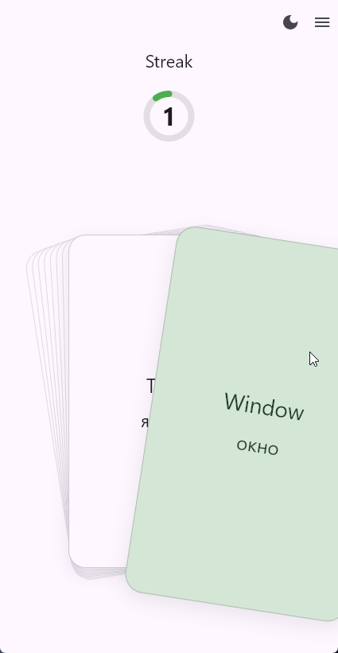
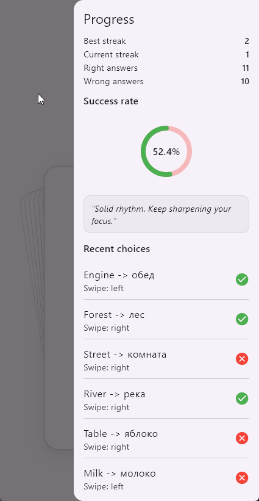
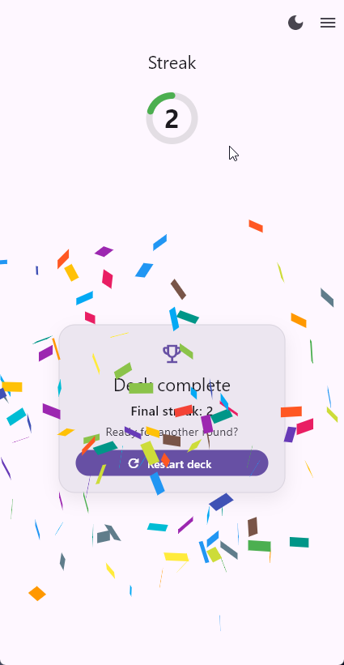

# Language Cards

Language Cards is a Flutter mini-app for vocabulary training with swipe-based decisions and session progress tracking.

## Preview

<p align="center">
	
	
	
</p>

## Completed Features

### Cards

- Custom swipe behavior (no swipe package)
- Right/left decision with velocity and distance thresholds
- Snap-back and fly-away animations
- Haptic feedback: light for correct, heavy for wrong
- Animated streak counter with circular progress ring
- Deck-complete confetti burst from both sides
- Retry state with completion summary card
- Shows all remaining cards visually in the deck stack (design decision)

### Progress Drawer

- Current streak and all-time best streak
- Total right/wrong answers across sessions
- Animated success-rate ring
- Last 10 swipe choices history
- Tiered motivational quotes based on success rate

## Data Flow

```text
DataSource (optional - DB, Network, Local)
	                |
	                v
              Repository
	                |
	                v
            Controller (Cubit)
	                |
	                v
	               UI
```

## State Management Decision

Cubit is used as the controller layer.

InheritedWidget from SDK, provider and flutter_bloc packages adapt and extend the flutter widgets tree architecture while other popular packages are just ported from different js frameworks (mobx, redux, etc) so developers would not spend time learning and adapting to how flutter works.

## Feature Contract

Each feature is standalone in `lib/features/<feature_name>/` and includes its own barrel file `<feature_name>.dart`, plus dedicated `controllers`, `models`, `repos`, `screens`, and `widgets` folders.

## Core Building Blocks

### Data Classes

- No code generation
- Explicit `copyWith`, equality, and JSON serialization
- `const Omit()` allows passing null values through `copyWith` parameters
- Data classes are generated with skills from `.github/skills`

### Repositories

- Abstract repo contract + multiple realizations (`Stub`, `Rest`, etc.)
- Seamless replacement of one realization with another
- Repo scaffolding is generated with skills from `.github/skills`

### Dependencies Container

- `Dependencies.init()` is a single entry point for dependency initialization
- Easily extensible for Firebase services and any external SDKs
- Repositories are stored in a `<Type, Object>{}` map
- Access is simple through `InheritedDependencies`
- Keeps DI lightweight without complex service-locator packages like `get_it`

### Result Wrapper

- `Result` is used to wrap computations and requests into success/error outcomes
- Easily unfolded in controller logic via `when(...)`
- Sync usage: `Result.wrap(function)`
- Async usage: `Result.wrapAsync(function)`

## Used Packages

- flutter_bloc
- confetti
- equatable

## Run

```bash
flutter pub get
flutter run
```

## Demo (Webm)

[demo.webm](https://github.com/user-attachments/assets/c4a6478f-e641-488f-bc87-1d4486a8f1b7)

If your Markdown viewer does not render the video element, open the file directly: [assets/demo.webm](assets/demo.webm)
